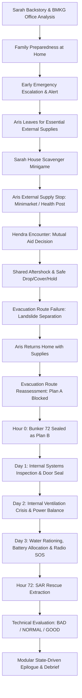

# Bunker 72 — Final Implementation Status

## 1. Product Intent and Educational Audience

Bunker 72 is a choice-driven narrative preparedness game designed for players aged 10 and above. It immerses players in the critical first 72 hours of a compound natural disaster (volcanic activity, severe seismic aftershocks, infrastructure collapse), emphasizing the vital distinction between direct observation, verified official information, cautious technical preparation, and hazardous assumptions.

### Character Canon
- **Aris (28)**: Founder of a small technology business, practical decision-maker, and family logistics coordinator.
- **Sarah (26)**: BMKG (Badan Meteorologi, Klimatologi, dan Geofisika) data analyst whose pre-disaster workflow centers on interpreting incomplete seismic/volcanic monitoring feeds and coordinating responsible information dissemination.
- **Maya (7)**: Their daughter. Speaks, acts, and reacts authentically as a child, remaining under attentive adult supervision throughout emergency actions.

### Narrative Grounding & Safety Principles
- **Location**: The family home and Bunker 72 are situated in the upland hills outside the coastal tsunami inundation zone.
- **Shelter Role**: Bunker 72 is a private family shelter constructed as a temporary safeguard against heavy volcanic ash fall and structural shaking. It is explicitly framed as **Plan B** when official evacuation routes become impassable. The game never portrays underground shelters as universal refuges against tsunamis, pyroclastic surges, toxic gases, or structural collapse.
- **Earthquake Safety**: During tremors, characters immediately execute Drop, Cover, and Hold in open or reinforced clearings away from exterior masonry, retaining walls, glass facades, and utility poles. Dangerous amateur search-and-rescue actions are strictly discouraged.
- **Volcanic Ash & Air Safety**: Particulate masks (N95/surgical) provide barrier protection against coarse volcanic dust and ash, but they do NOT supply oxygen, do NOT scrub carbon dioxide, and never substitute for adequate shelter ventilation. Low-power blower operation is framed as an intentional emergency conservation mode, maintaining essential airflow safely.
- **Water & Food**: Boiling and standard micro-filtration protect against sediment and biological contamination from clean rain/cistern sources; they are never depicted as rendering chemically tainted or heavily ash-choked water potable.
- **Institutional Roles**:
  - **BMKG**: Official agency for meteorological, climatological, and geophysical (earthquake/tsunami) monitoring. Sarah operates strictly within her analytical role and never issues unlawful personal evacuation decrees.
  - **PVMBG / Badan Geologi**: Official authority for volcanic activity status and geological hazard zones.
  - **BPBD / Local Government**: Responsible for community disaster response, local evacuation orders, and civil defense.
  - **Basarnas / SAR**: Official search and rescue authority conducting sector sweeps and rescue extractions.

---

## 2. Canonical Playable Flow (`sealed72`)

The canonical `sealed72` campaign follows a continuous 72-hour timeline ending at Hour 72:

There is strictly no active Day 4, no 96-hour continuation, no looter combat, and no supernatural or secret endings. Exactly three terminal endings conclude the experience.

---

## 3. Save Architecture and Strict Revision Isolation

### Schema Version 4 (`SAVE_SCHEMA_VERSION = 4`)
State persistence uses Schema Version 4, featuring strict isolation between active and legacy branches:
- **`sealed72`**: The canonical restructured game. Day 2 is an internal shelter crisis; external expeditions and Hendra encounters take place in the prologue.
- **`legacy_phase7`**: Frozen, preserved original release path where expeditions occur on Day 2. The legacy dataset (`storyLegacyPhase7.json`) is immutable and strictly isolated.

### Migration & Recovery Foundation
- Automatic, idempotent migration handles saves from version 1, 2, 3 to version 4 upon load.
- Corrupted or legacy data triggers an automated backup in `localStorage` under `bunker72_save_v1_backup_v4_<timestamp>`.
- Future schema versions are safely ignored to prevent destructive overwriting.
- Cross-revision fallback is strictly prohibited: scenes missing from one revision never leak or fetch from another.
- Atomic commit transactions protect minigame rewards (`houseScavengeResult` and legacy expeditions), preventing duplicate item grants or inventory loss across reloads.

---

## 4. The Three Canonical Technical Endings

Ending evaluation (`getEndingResult`) is purely deterministic and evaluates technical preparedness and physical health. **Zero social or emotional flags are read by the ending evaluator.**

### Preparedness Scoring Matrix (Total: 100 Points)

| Category | Maximum Points | Key Contributing Decisions |
| :--- | :---: | :--- |
| **Air & Shelter** | 20 | Day 1 door seal, Day 2 ventilation restoration, Day 3 air filter preservation |
| **Clean Water** | 15 | Water filtration, protected storage, rationing protocols |
| **Emergency Power** | 15 | Power circuit management, Day 2 conservation, battery protection |
| **SAR Communication** | 15 | Radio repair, frequency tuning minigame, VHF transmission clarity |
| **Technical Inspection**| 15 | Day 1 pre-lockdown inspections of ventilation, power, and communications |
| **Logistics & Medical** | 20 | Staged household food, clean water, medical kits, auxiliary batteries |

### Ending Outcomes
1. **`ending_good` (Bertahan dengan Stabil)**:
   - **Conditions**: Preparedness $\ge 60$ points, Health $\ge 55$, vital conditions stable.
   - **Experience**: The family's technical diligence preserved sufficient operating margin. Rescued in stable physical and emotional health.
2. **`ending_normal` (Selamat dengan Konsekuensi)**:
   - **Conditions**: Preparedness $< 60$ or Health $< 55$ (with Health $> 0$).
   - **Experience**: The family survives, but resources were depleted, emergency power was exhausted, and physical fatigue is noticeable.
3. **`ending_bad` (Penyelamatan Kritis)**:
   - **Conditions**: Health $= 0$.
   - **Experience**: Canonical **critical rescue**—NOT family death. Bunker systems reach maximum failure threshold; SAR breaches the shelter and evacuates Aris, Sarah, and Maya alive in severe physical exhaustion, requiring immediate intensive medical care. Age 10+ compliant with zero graphic violence or fatality.

### Independence of Technical & Social Systems
- Helping Hendra (`c_prolog_hendra_help`, `helped_stranger`) consumes Supply Opportunity #2 / remaining expedition time (`prolog_opt2_consumed = true`). It does **not** automatically consume `inventory.kit` and does not preclude Good with sound technical choices.
- Choosing Family First (`stranger_family_first`) leaves Opportunity #2 available without moral penalties or hidden narrative locks. Both choices preserve the same pre-choice inventory; later supply collection or legitimate item use is separate.
- A failed radio attempt (`radio_quality: 'failed'`) can still achieve the Good ending ($\ge 60$ score) through sector searches and residential records.
- Sarah's BMKG advisory response (`sarah_warning_response`) influences public context in the epilogue without modifying technical preparedness.

---

## 5. Modular Epilogue System (`evaluateModularEnding`)

Following the technical ending cutscene, a sequence of state-driven narrative cards renders the precise consequences of the player's choices:

### Card Sequencing
- **NORMAL and GOOD Endings**:
  1. `rescue`: SAR operation summary (clear transmission, weak coordinates, or sector sweep).
  2. `sarah_public_impact`: Public impact of Sarah's early advisory (`escalate`, `verify`, or `maintain`).
  3. `family`: Aris & Sarah's joint partnership and shared burdens.
  4. `maya`: Emotional payoff for the red toy car, comfort, and the promise to return home safely.
  5. `hendra`: Narrative closure if Hendra was helped (sincere gratitude at the hillside evacuation post; strictly omitted if family-first).
  6. `bunker`: Technical aftermath (structural integrity, Day 2 filter/power callbacks, VHF battery independence).
  7. `preparedness`: Supportive, non-punitive debrief highlighting well-prepared systems and areas for improvement.
- **BAD Ending**:
  1. `rescue`: Urgent extraction and emergency medical prioritization.
  2. `sarah_public_impact`: Sarah's professional legacy.
  3. `family`: Family endurance and long medical recovery.
  4. `bunker`: Equipment abandonment and shelter condition.
  5. `preparedness`: Key technical lessons for disaster readiness.
  6. `hendra`: Brief acknowledgment in transit if helped, without obstructing urgent medical triage.

---

## 6. Implemented Minigames & Specialized Systems

1. **Sarah Office Analysis**:
   - Interactive document examination modal analyzing seismic station feeds, tremor duration, and ground-displacement data.
   - Requires review of primary feeds before unlocking advisory response choices (`escalate`, `verify`, `maintain`).
2. **House Scavenger Minigame (`ScavengerMinigame`)**:
   - 2D canvas grid with responsive keyboard (WASD/arrows) and mobile touch virtual D-pad.
   - 45-second simulated evacuation countdown. Sarah navigates the home staging essential supplies (food, water, first aid, extra battery, Maya's toy car) at the basement shelter access.
3. **Radio Frequency Tuning Minigame (`RadioMiniGame`)**:
   - Analog dial tuning interface with interactive frequency adjustment and real-time audio static feedback.
   - Evaluates signal resonance to determine SAR transmission quality (`clear`, `weak`, `failed`).
4. **Bunker Inspection Hotspots**:
   - Interactive SVG/DOM hotspot overlays during Day 1 lockdown allowing up to 3 detailed technical inspections (ventilation, electrical circuits, emergency radio).

---

## 7. Verification Test Suites

Deterministic verification scripts run in Vite SSR node environments to validate state, schema, narrative invariants, and graph connectivity:

| Test Suite | Purpose & Coverage | Status |
| :--- | :--- | :---: |
| `node scripts/verify_phase_a.mjs` | Schema v4, revision isolation, migration fixtures A–P, atomic result commits. | **PASS** |
| `node scripts/verify_phase_b.mjs` | House scavenger mechanics, prologue narrative split, supply staging. | **PASS** |
| `node scripts/verify_phase_c.mjs` | Prologue supply run, Hendra encounter, identical-inventory HELP/FAMILY FIRST assertions (0/1/2 kits), Opportunity #2 cost, open-air aftershock, route failure. | **PASS** |
| `node scripts/verify_phase_d.mjs` | Day 2 internal crisis, single-use filter idempotency, safe ventilation modes. | **PASS** |
| `node scripts/verify_phase_e.mjs` | Modular epilogue sequencing, social flag invariance, failed-radio GOOD path. | **PASS** |
| `node scripts/verify_phase_f.mjs` | 6 model-state archetypes (not browser playthroughs), rescue copy grounding, power/battery terminology. | **PASS** |
| `node scripts/verify_release.mjs` | 73 scenes, 77 choices, 12 ending combinations, runtime reachability. | **PASS** |

### Production Build & Lint Gates
- `cmd.exe /c "npm run build"`: Bundles with Vite in production mode with zero errors (79 modules transformed, asset hashing verified).
- `git diff --check`: No whitespace errors reported by Git.

---

## 8. Verification Boundary & Operational Notes

- **Automated Verification**: Phase A–F and release checks execute static assertions and Node/Vite SSR model/controller simulations with mocked browser services. Phase F archetypes initialize ending-state fixtures; they are not full interactive playthroughs. Production bundling is a separate build check.
- **Browser Evidence**: No successful Phase F/final-pass browser or physical-device run is established. Playwright resolution in this final pass returned `MODULE_NOT_FOUND`. `scripts/verify_release_browser.mjs` is an available harness, not proof of execution. Screenshots in `scratch/release-qa` dated September 6, 2026 are historical artifacts and do not certify the current release. The harness also contains legacy scene/save assumptions, so its existence does not establish current `sealed72` coverage.
- **Unverified Browser/Device Checks**: Actual rendering at 390x844 and 844x390, touch interaction, keyboard focus/Tab/Enter/Space/Escape behavior, real AudioContext/autoplay policy, browser console errors, 60 FPS, memory leaks, and actual HTTP 404/network behavior remain unverified for this release. The harness listens for uncaught `pageerror` events; it does not establish console, audio, performance, memory, or network coverage.
- **Asset Integrity Boundary**: Static asset-reference checks and production bundling do not prove successful browser decoding/playback or absence of HTTP 404 responses.
- **QA Boundary**: Static/responsive code review and deterministic verification are separate from real browser/device validation, which remains a recommended non-blocking manual check.
- **Release Status: READY WITH MINOR ISSUES** — automated suites and production build pass; real browser/device QA remains. For this school project, this verification gap alone is not a release blocker.
